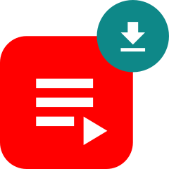
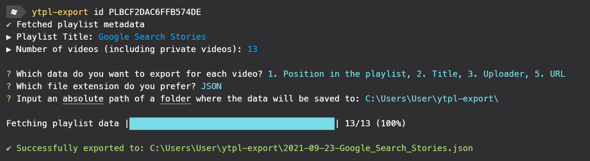
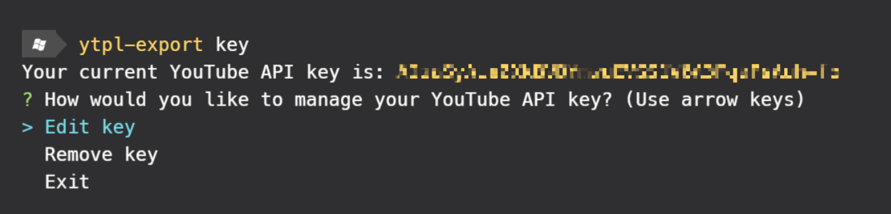
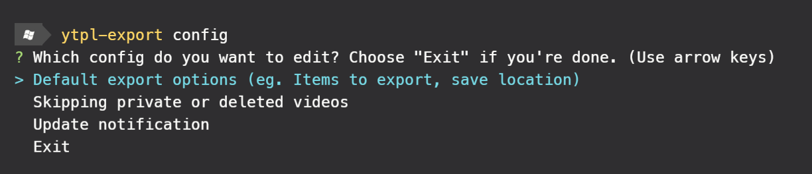

<div align="center">
  
  <h1>youtube-playlist-export</h1>
  <p>Node.js command line app for exporting video data from a YouTube playlist to a JSON/CSV file.</p>
  
</div>

## About

This app lets you download the [metadata of each video](#exportable-items) (e.g. video title, URL, uploader, and etc.) from a public/unlisted YouTube playlist and saves it to a JSON or CSV file.

> 🚨 This app does **not** download videos from a YouTube playlist. It only downloads **text-based metadata** of videos from a playlist.

## Installation

> ⚠️ Requires **Node v12** or higher.

1. Install the app:
   ```
   $ npm install -g youtube-playlist-export
   ```
2. Run the following command in Terminal to confirm that it's properly installed:
   ```
   $ ytpl-export --help
   ```
3. Get a YouTube API v3 key for free:

   - 3 min. YouTube tutorial - [How to Get YouTube API Key 2021](https://youtu.be/N18czV5tj5o)
   - RapidAPI blog article - [How To Get a YouTube API Key (in 7 Simple Steps)](https://rapidapi.com/blog/how-to-get-youtube-api-key/)

4. Run the following command and follow the on-screen instructions to register the YouTube API key:
   ```
   $ ytpl-export key
   ```

## Usage

```
$ ytpl-export --help
```

```
Exports video data from a YouTube playlist to JSON/CSV file.

Usage: ytpl-export [options] [command]

Options:
  -V, --version              output the version number
  -h, --help                 display help for command

Commands:
  id [options] <playlistId>  Export video metadata of a playlist by its playlist ID.
  key                        Manage your YouTube API key.
  config [options]           Edit configurations of this app.
  help [command]             display help for command
```

### Export Playlist

Export a YouTube playlist given its playlist ID.

```
$ ytpl-export id <playlistId>
```

To find the playlist ID, head to the playlist homepage and copy the value of the `list` parameter in the URL (`https://www.youtube.com/playlist?list=[playlistId]`). For example, the [Google Search Stories](https://www.youtube.com/playlist?list=PLBCF2DAC6FFB574DE) playlist has a playlist ID of `PLBCF2DAC6FFB574DE`.



#### Flags

- `-d`/`--default` - Skip all prompt questions and use the default configurations

#### Exportable Items

| Item                      | JSON/CSV Key Name |
| ------------------------- | ----------------- |
| Position in the playlist¹ | `position`        |
| Title                     | `title`           |
| Uploader                  | `uploader`        |
| Uploader URL              | `uploaderUrl`     |
| Description               | `description`     |
| Video privacy             | `videoPrivacy`    |
| Publish time (UTC)        | `publishTime`     |

¹ Playlist position starts from 0

#### Save Location

You can specify the absolute path of a folder where the files will be saved to. The default value is `~/ytpl-export`. The folder will be created if it doesn't exist.

Since it requires an **absolute** path, here are same examples:

- ✔️ `C:\Users\User\Downloads` (Windows)
- ✔️ `/usr/ytpl-export` (Mac/Linux)
- ❌ `../ytpl-export`

#### Example Output

The app outputs the following when running `ytpl-export id PLBCF2DAC6FFB574DE`:

<details>
   <summary>JSON</summary>

```json
[
  {
    "position": 0,
    "title": "Andrew Willis, Skatepark Engineer",
    "uploader": "Google Search Stories",
    "url": "https://youtu.be/GvgqDSnpRQM"
  },
  {
    "position": 2,
    "title": "Mark Lesek: A New/Old Prosthetic",
    "uploader": "Google Search Stories",
    "url": "https://youtu.be/V4DDt30Aat4"
  },
  {
    "position": 4,
    "title": "Mark Kempton: Neighbors In Need",
    "uploader": "Google Search Stories",
    "url": "https://youtu.be/XDgC4FMftpg"
  },
  {
    "position": 5,
    "title": "Zack Matere: Growing Knowledge",
    "uploader": "Google Search Stories",
    "url": "https://youtu.be/OE63BYWdqC4"
  },
  {
    "position": 6,
    "title": "Mitch Dobrowner: Epic Storms",
    "uploader": "Google Search Stories",
    "url": "https://youtu.be/RQbmXxU2dkg"
  },
  {
    "position": 7,
    "title": "The Tofino Riders: A 1,000 Year-Old-Wave",
    "uploader": "Google Search Stories",
    "url": "https://youtu.be/7nJdEXpvi1g"
  },
  {
    "position": 8,
    "title": "David Kennedy: Ancient Ruins",
    "uploader": "Google Search Stories",
    "url": "https://youtu.be/7hakGJU9xco"
  },
  {
    "position": 9,
    "title": "Caroline: Supernova 2008ha",
    "uploader": "Google Search Stories",
    "url": "https://youtu.be/x9-F6dbCIHw"
  },
  {
    "position": 11,
    "title": "Erik-Jan Bos: A Letter from an Old Friend",
    "uploader": "Google Search Stories",
    "url": "https://youtu.be/18TknKGC7tY"
  },
  {
    "position": 12,
    "title": "Cheryl and Morgan: Learning Independence",
    "uploader": "Google Search Stories",
    "url": "https://youtu.be/CyRQJBBVI7g"
  }
]
```

</details>

<details>
   <summary>CSV</summary>

```csv
"position","title","uploader","url"
0,"Andrew Willis, Skatepark Engineer","Google Search Stories","https://youtu.be/GvgqDSnpRQM"
2,"Mark Lesek: A New/Old Prosthetic","Google Search Stories","https://youtu.be/V4DDt30Aat4"
4,"Mark Kempton: Neighbors In Need","Google Search Stories","https://youtu.be/XDgC4FMftpg"
5,"Zack Matere: Growing Knowledge","Google Search Stories","https://youtu.be/OE63BYWdqC4"
6,"Mitch Dobrowner: Epic Storms","Google Search Stories","https://youtu.be/RQbmXxU2dkg"
7,"The Tofino Riders: A 1,000 Year-Old-Wave","Google Search Stories","https://youtu.be/7nJdEXpvi1g"
8,"David Kennedy: Ancient Ruins","Google Search Stories","https://youtu.be/7hakGJU9xco"
9,"Caroline: Supernova 2008ha","Google Search Stories","https://youtu.be/x9-F6dbCIHw"
11,"Erik-Jan Bos: A Letter from an Old Friend","Google Search Stories","https://youtu.be/18TknKGC7tY"
12,"Cheryl and Morgan: Learning Independence","Google Search Stories","https://youtu.be/CyRQJBBVI7g"
```

</details>

### API Key

Register, modify, or delete your YouTube API key.

```
$ ytpl-export key
```

First-time users for registering YouTube API key:


After registering the API key:



> ✔️ Your API key will only be stored in your local computer.

### Configuration

Configure preferences of this app.

```
$ ytpl-export config
```



#### Flags

- `-p`/`--path` - Show the path of the where the config file is stored
- `-r`/`--reset` - Reset all configurations to default values (see below)

#### Default Config

- Items to export: Position in the playlist, Title, Uploader, URL
- File extension: JSON
- Save location: `~/ytpl-export`
- Notify updates: Enabled
- Skip private/deleted videos: True

## Development

### Set-Up

```bash
# 1. Install yarn if you haven't
$ npm install -g yarn

# 2. Install dependencies
$ yarn

# 3. Build from source code
$ yarn run build

# 4. Confirm that it works
$ node dist/cli.js --help
```

### Test

All tests are written in [Jest](https://jestjs.io/) and they are located in the `tests` folder. To run all tests:

```bash
$ yarn run test

# Alternatively, run this to generate a coverage report
$ yarn run test:coverage
```

Note that [`clearMocks`](https://jestjs.io/docs/configuration#clearmocks-boolean) is set to `true`, which Jest will automatically clear mock calls and instances before every test.

## Limitations

This app uses [YouTube API v3](https://developers.google.com/youtube/v3/) under the hood. However, due to limitations of the API, it **cannot** perform the following actions:

- Export your "Watch Later" playlist
- Export private playlists
- Export most metadata of deleted or private videos, such as the original video title and description
- Download each video, not its metadata, in mp3, mp4, wmv, or other formats

## Related Work

- [youtube-playlist-summary](https://www.npmjs.com/package/youtube-playlist-summary) - A module for getting YouTube playlist data
- [usetube](https://www.npmjs.com/package/usetube) - A module for crawling YouTube data without a YouTube API key
